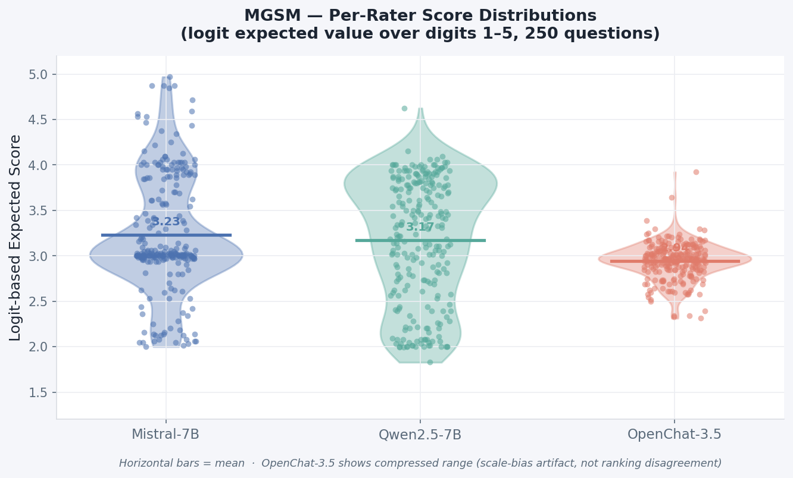
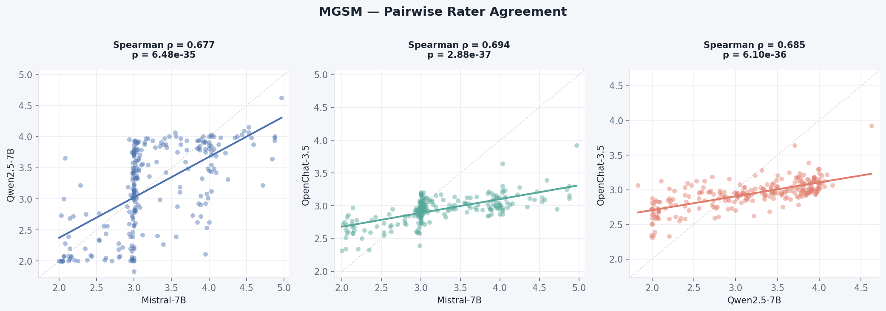
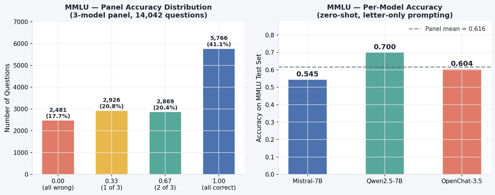
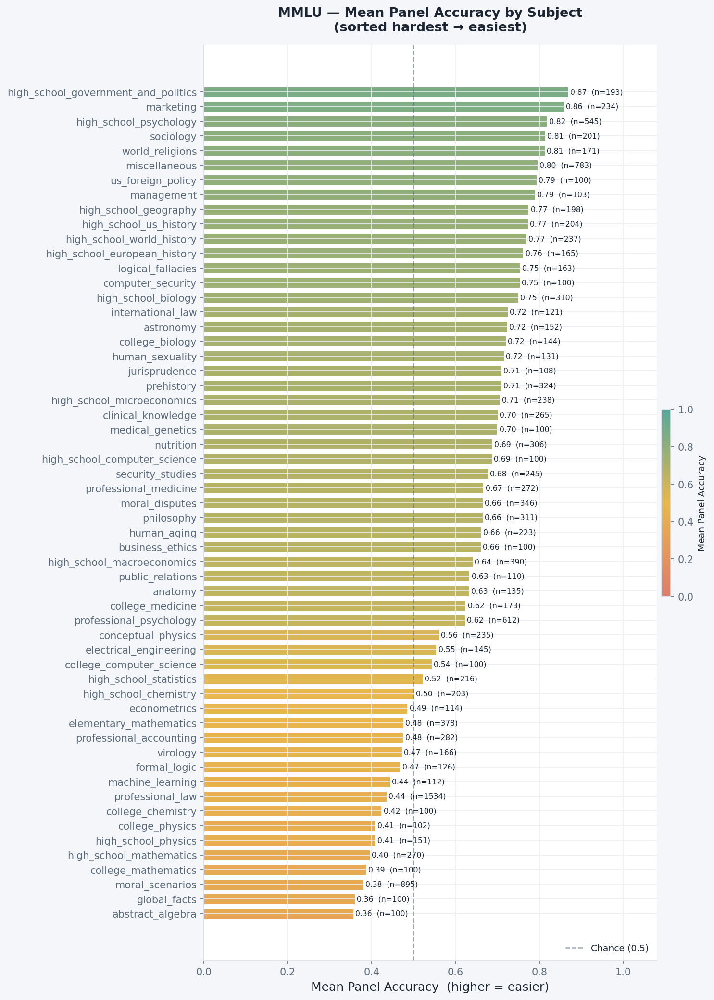

# H3 Difficulty Labeling

This directory contains the pipelines and output labels used to assign difficulty scores to **MGSM** and **MMLU** questions in support of **Hypothesis 3 (H3)**: that as task difficulty increases, the reasoning traces produced by Tiny Aya for non-English prompts drift toward English.

---

## Overview

Two separate strategies were used depending on the task type:

| Dataset | Questions        | Difficulty Signal               | Method                                                     |
| ------- | ---------------- | ------------------------------- | ---------------------------------------------------------- |
| MGSM    | 250 (English)    | `mean_score`                    | Logit-based expected value over digits 1–5, 3 rater models |
| MMLU    | 14,042 (English) | `panel_accuracy` → `difficulty` | Binary correct/incorrect, 3 panel models                   |

Difficulty labels assigned on English propagate to all other languages via a shared key (`answer_number` for MGSM, `sample_id` for MMLU).

**Rater models** (all 4-bit NF4 quantized, dual NVIDIA Tesla T4 GPUs.):

- `mistralai/Mistral-7B-Instruct-v0.2`
- `Qwen/Qwen2.5-7B-Instruct`
- `openchat/openchat-3.5-0106`

---

## MGSM

### Method

MGSM contains 250 open-ended arithmetic word problems. Because there is no single correct answer letter to check, we cannot use panel accuracy directly. Instead, three 7B-class instruction-tuned models score each question on a 1–5 reasoning-complexity scale using a **logit-based expected value** approach:

1. The model is prompted with a system instruction defining a 1–5 reasoning-complexity scale and shown the question but explicitly told **not to solve it**.
2. Instead of generating text, the raw logits at the next-token position are extracted for the five digit tokens (`"1"` through `"5"`).
3. These five logits are softmax-normalised into a probability distribution over {1, 2, 3, 4, 5}.
4. The **expected value** E[score] = Σ p_i · i is returned as a continuous float in [1.0, 5.0].

This approach produces zero parse failures (no text extraction), zero stochastic variance (fully deterministic, no sampling), and higher resolution than integer ratings all of which improve the reliability of the downstream difficulty signal.

**Aggregation**: Scores from the three raters are averaged into `mean_score`. Inter-rater reliability is assessed with Krippendorff's α (ordinal distance metric).

**Difficulty signal for H3**: `mean_score` is used directly as a continuous difficulty signal. Higher = harder.

### Results

---

## MMLU

### Method

MMLU contains 14,042 multiple-choice questions across 57 subjects loaded from `CohereLabs/Global-MMLU` (`"en"`, `split="test"`). Global-MMLU is preferred over `cais/mmlu` for two reasons:

Each panel model outputs only the correct answer letter (A/B/C/D) with `MAX_NEW_TOKENS=10` and `BATCH_SIZE=16`. A 6-layer fallback parser handles all common instruct-model output formats.

**Difficulty signal**: `panel_accuracy` = fraction of three models correct ∈ {0.0, 0.33, 0.67, 1.0}.

**Difficulty mapping**:

- `easy` — all three models correct (panel_accuracy = 1.0)
- `hard` — fewer than three correct (panel_accuracy < 1.0)

> For H3 regression use `panel_accuracy` directly as a continuous signal (or `1 − panel_accuracy` as a difficulty score, so higher = harder), rather than the binary `difficulty` label.

### Results

---
